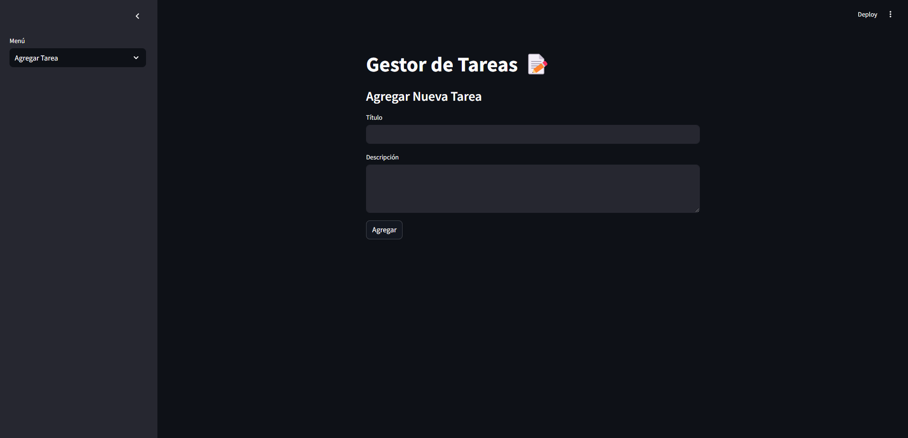
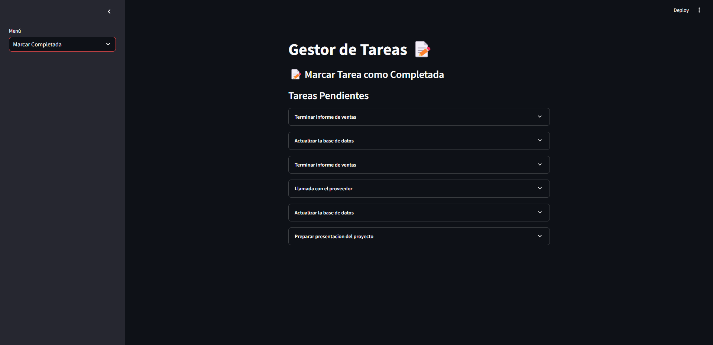
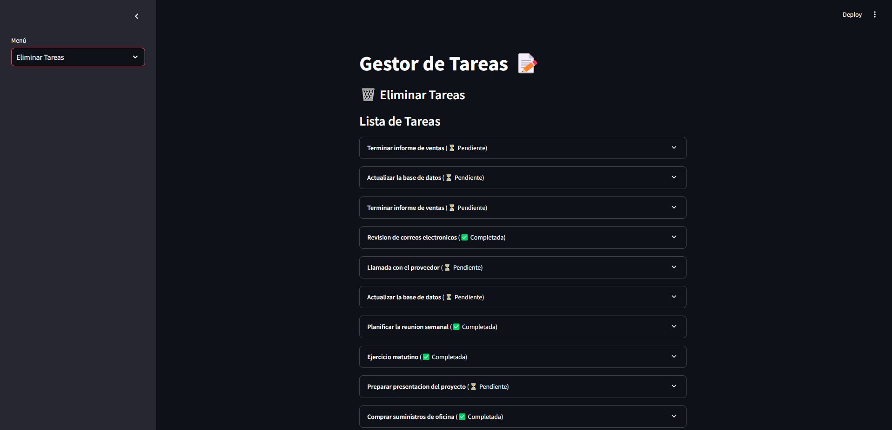
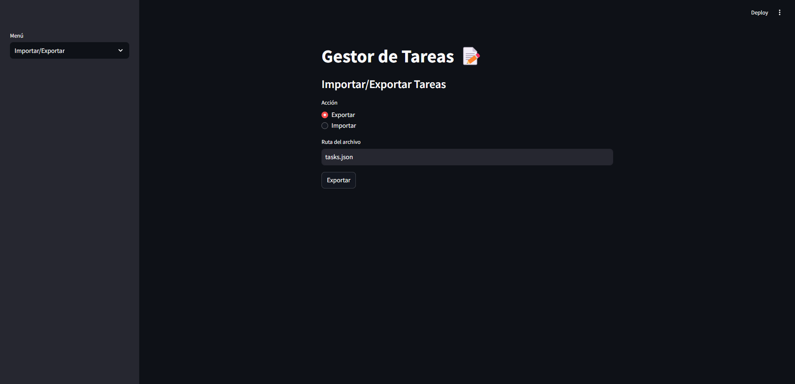

# Gestor de Tareas 📝

Este proyecto es un **Gestor de Tareas** interactivo desarrollado con **Streamlit** y **SQLAlchemy**. Permite agregar, listar, marcar tareas como completadas, eliminarlas e importar/exportar tareas en formato JSON.

---

## 🚀 **Requisitos previos**

1. Tener **Python 3.8+** instalado.
2. Tener acceso a **pip** (el gestor de paquetes de Python).
3. Tener instalado **Git** si deseas clonar el repositorio.

---

## 🛠️ **Instalación**

### 1. Clonar el repositorio

Clona el proyecto usando el siguiente comando:

```bash
git clone https://github.com/OscarSebastianRuedaRojas/GestorDeTareas
cd GestorDeTareas

```

### 2. Crear un entorno virtual (opcional, pero recomendado)

Crear y activar un entorno virtual te ayudará a evitar conflictos con otras dependencias de Python.

```bash
python -m venv venv
venv\Scripts\activate
```

### 3. Instalar las dependencias

Una vez dentro del directorio del proyecto y con el entorno virtual activo (si lo creaste), instala las dependencias necesarias usando el archivo requirements.txt. Ejecuta:

```bash
pip install -r requirements.txt
```
## ▶️ Cómo ejecutar el programa

Una vez que hayas instalado las dependencias, puedes ejecutar el programa con Streamlit. Desde la terminal, navega al directorio donde se encuentra el archivo app.py y ejecuta:

```bash
streamlit run app.py
```

## 📝 Uso de la aplicación

La aplicación permite realizar las siguientes acciones:

Agregar Tarea: Crea nuevas tareas con un título y descripción.

Listar Tareas: Muestra todas las tareas (pendientes y completadas).

Marcar Completada: Permite seleccionar tareas pendientes y marcarlas como completadas.

Eliminar Tareas: Elimina las tareas completadas, con una confirmación de si están pendientes o completadas.

Importar/Exportar: Permite exportar las tareas a un archivo JSON o importar tareas desde un archivo existente.


Cada opción está disponible en el menú lateral de la aplicación. Solo selecciona la opción que deseas y sigue las instrucciones en pantalla.


## 👤 Autor

Sebastian Rueda

Github: https://github.com/OscarSebastianRuedaRojas
